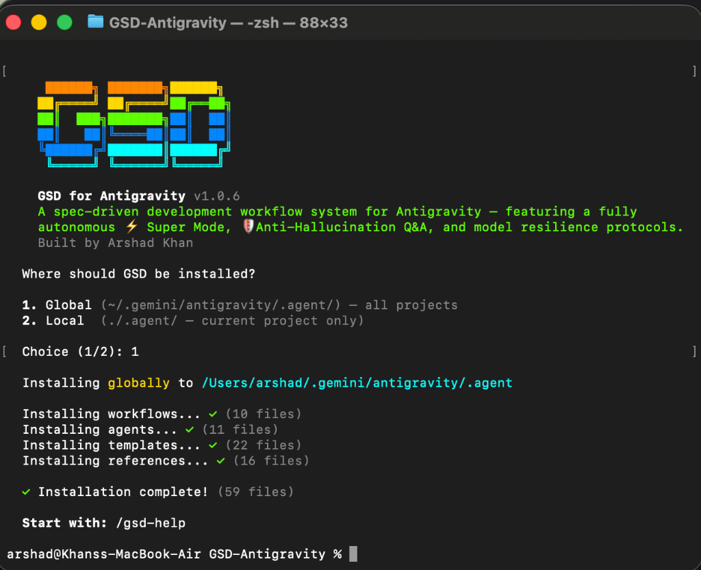

<div align="center">

# GSD for Antigravity 🚀

**A spec-driven development workflow system for [Antigravity](https://deepmind.google/) — featuring a fully autonomous ⚡ [Super Mode](#-super-mode--full-autonomy), 🛡️ [Anti-Hallucination Q&A](#-anti-hallucination-qa--verified-research), and 🧠 [Project Memory](#-project-memory--context-distillation) protocols.**

<br>

*The complexity is in the system, not in your workflow.*

*Behind the scenes: context engineering, structured XML plans, state management.*

*What you see: a few commands that just work.*

<br>

**Built on [Get Shit Done](https://github.com/gsd-build/get-shit-done), solving context rot, hallucination, and quality drops across models.**

<br>

[](https://github.com/KhanXBT/get-shit-done-antigravity)
[](LICENSE)
[](CHANGELOG.md)
[](https://github.com/gsd-build/get-shit-done)

<br>

```bash
npx get-shit-done-antigravity
```

<br>

**Works on Mac, Windows, and Linux.**

<br>



<br>

<br>

*"I stopped losing work to context rot. Every phase picks up exactly where the last one left off."*

*"Claude hit quota, Gemini took over, and the code quality didn't drop. That's when I knew this was different."*

*"It's not just a planning tool — it actually catches when the AI is making stuff up."*

<br>

> 🧪 **I'm actively testing this in production and made it open source so others can test, improve, and contribute.**
> — Built by [@KhanXBT](https://github.com/KhanXBT)

<br>

[How It Works](#how-it-works) · [Commands](#commands) · [Why It Works](#why-it-works) · [What's New](#-whats-new--ported-vs-invented) · [User Guide](docs/USER-GUIDE.md)

</div>

---

## Why This Exists

[GSD](https://github.com/gsd-build/get-shit-done) by TÂCHES is the best spec-driven development system for AI coding — but it only runs on Claude Code, OpenCode, and Gemini CLI.

**GSD for Antigravity** takes the methodology and makes it better. Same structured approach. Same atomic commits. **Plus original features the original GSD doesn't have** — because Antigravity's multi-model architecture creates problems that single-model tools never face.

---

## [1.0.9] - 2025-02-19
### Added
- **Project Memory System** — Long-term context distillation via `/gsd-commit-memory`.
- **Automated Verification Suite** — Production-grade CLI tests now part of the core repository.

## [1.0.8] - 2025-02-19
### Added
- **Post-Install Guidance** — Replicated the original GSD "Done! Run /gsd-help to get started" experience in all installers.

## [1.0.7] - 2025-02-19
### Fixed
- **README Rendering** — Moved showcase image to `assets/` with relative paths for GitHub/npm compatibility.

---

## 🆕 What's New — Ported vs Invented

This isn't just a port. **~40% is adapted from the original GSD, ~60% is our own innovation** built for Antigravity's multi-model reality:

| Feature | Origin | Details |
|---------|--------|---------|
| Spec-driven workflow (plan → execute → verify) | ✅ Ported from GSD | Adapted for Antigravity's tool system |
| Atomic git commits per task | ✅ Ported from GSD | Same approach |
| XML task plans with verify/done criteria | ✅ Ported from GSD | Same structure |
| Context freshness (`/clear` → new conversation) | ⚡ Adapted from GSD | Original uses `/clear`, we recommend new conversations |
| Source verification hierarchy | ⚡ Adapted from GSD | Original uses Context7 MCP, we use `read_url_content` + `search_web` |
| Checkpoints (wait for user) | ⚡ Adapted from GSD | Original uses `AskUserQuestion`, we use `notify_user` |
| **🛡️ Anti-Hallucination Engine** | **🆕 Our Invention** | Structural safeguards + `/gsd-no-halluc` for verified Q&A |
| **🧠 Project Memory** | **🆕 Our Invention** | Permanent context preservation via `/gsd-commit-memory` |
| **🤖 Multi-Model Compatibility** | **🆕 Our Invention** | Per-model hallucination pattern guards (Claude, Gemini, GPT, OSS) |
| **🔄 Model Resilience** | **🆕 Our Invention** | Code quality stays consistent when Claude quota → Gemini switch |
| **📋 Code Patterns in Plans** | **🆕 Our Invention** | Plans reference existing files as style templates for any model |
| **🎯 Style Anchoring Protocol** | **🆕 Our Invention** | Read existing code before writing — match patterns exactly |
| **✅ Full Verification Suite** | **🆕 Our Invention** | Lint + types + tests + build after EVERY task, not just plan verify |
| **⚡ Super Mode (`/gsd-super`)** | **🆕 Our Invention** | Full autonomy: prompt → production with zero human input |

> **The original GSD doesn't need these features** because it only runs on Claude.
> Antigravity rotates between models — creating problems that single-model tools never face.
> **We solve them.**

---

## ⚡ Super Mode — Full Autonomy

**The first "walk away" build engine for AI coding agents.** 

Give it a prompt or PRD, answer a few questions, and go grab a coffee. `/gsd-super` runs the entire lifecycle autonomously.

### Core Capabilities:
*   **PRD Intelligence**: Auto-expands one-liners or parses large PRDs into roadmaps.
*   **Context Discovery**: Auto-branches (`gsd-super/feature`) for total safety.
*   **5-Tier Verification**: `Syntax → Types → Lint → Tests → Build` on every atomic task.
*   **Visual Autonomous Testing**: The AI verified the UI matches the spec via browser screenshots.

---

## 🛡️ Anti-Hallucination Q&A — Verified Research

**The end of "plausible fabrication" in AI coding.**

Use `/gsd-no-halluc [question]` (or alias `/no-halluc`) for verified technical research.

### How it works:
*   **Mandatory Research Loop**: Forbidden from answering without proof (`search_web`/`read_url_content`).
*   **Confidence Scoring**: Tagged **HIGH**, **MEDIUM**, or **LOW** with direct citations.
*   **Truth-First Protocol**: Instructed to say "I don't know" rather than guess.

---

## 🧠 Project Memory — Context Distillation

**Long-term architectural continuity across conversation resets.**

Use `/gsd-commit-memory "Lessons learned..."` (or alias `/gsd memo`) to save major pivots and decisions.

### Why it's needed:
Models often forget subtle design constraints after a conversation reset. Project Memory distills your `STATE.md`, `ROADMAP.md`, and manual insights into a permanent log inside `.planning/memory/`. Future AI workflows are instructed to read this first, ensuring your project doesn't drift.

---

## Getting Started

### Installation

**Clone and install:**

**Mac / Linux:**
```bash
git clone https://github.com/KhanXBT/get-shit-done-antigravity.git
cd get-shit-done-antigravity
bash scripts/install.sh           # Global install (all projects)
bash scripts/install.sh --local   # Local install (current project only)
```

**Windows (PowerShell):**
```powershell
git clone https://github.com/KhanXBT/get-shit-done-antigravity.git
cd get-shit-done-antigravity
.\scripts\install.ps1              # Global install (all projects)
.\scripts\install.ps1 -Local       # Local install (current project only)
```

**Or copy manually:**
```bash
cp -r workflows/*.md ~/.gemini/antigravity/.agent/workflows/
```

### Verify

Inside Antigravity, type:
```
/gsd-help
```

---

## How It Works

> **🚀 Want full autonomy?** Use `/gsd-super` to build an entire project from a single prompt.
>
> **🛡️ Want verified answers?** Use `/gsd-no-halluc [question]` for general Q&A with strict verification.
>
> **🧠 Want context to stick?** Use `/gsd-commit-memory` to save key decisions to long-term memory.

### 1. Initialize Project
```
/gsd-new-project
```
Initialization: questions → research → requirements → roadmap.

### 2. Discuss Phase
```
/gsd-discuss 1
```
Capture implicit preferences (Layout, API structure, Naming) before planning.

### 3. Plan Phase
```
/gsd-plan 1
```
Detailed XML implementation plans with **Style Anchoring**.

### 4. Execute Phase
```
/gsd-execute 1
```
Wave-based execution with atomic commits and 5-tier verification.

### 5. Verify Work
```
/gsd-verify 1
```
User Acceptance Testing with automated gap analysis for fix-plans.

### 6. Commit Memory
```
/gsd-commit-memory "Major decision: switched to SQLite for simplicity."
```
Lock in the context permanently.

---

## Commands

### ⚡ Core Innovation Pillar
| Command | Profile | What it does |
|---------|---------|-------------|
| `/gsd-super` | **Autonomous** | Build an entire project from a single prompt (Walk-away mode) |
| `/gsd-no-halluc` | **Verified** | Technical Q&A with mandatory external research and citations |
| `/gsd-commit-memory`| **Continuity** | Distill and save major project decisions to long-term memory |

### 🏗️ Standard GSD Workflow
| Command | Task | What it does |
|---------|-------|-------------|
| `/gsd-new-project` | **Setup** | Questions → Research → Requirements → Roadmap |
| `/gsd-discuss [N]` | **Context** | Capture implementation preferences for a phase |
| `/gsd-plan [N]` | **Blueprint** | Technical planning and research for a phase |
| `/gsd-execute [N]` | **Builder** | Autonomous execution with atomic git commits |
| `/gsd-verify [N]` | **Audit** | Human-in-the-loop verification and bug tracking |

### 🛠️ Utilities
| Command | What it does |
|---------|-------------|
| `/gsd-quick [desc]` | Small ad-hoc task with GSD quality guarantees |
| `/gsd-progress` | Pulse check: Current state, roadblocks, and next steps |
| `/gsd-help` | Comprehensive manual of all commands and methodologies |

---

## Why It Works

### Context Engineering
Instead of dumping everything into one long conversation where quality degrades, GSD structures project knowledge across purpose-built files. Each workflow loads only what's needed — keeping context focused and AI output quality high.

### XML Prompt Formatting
Plans are structured XML that gives the AI precise, unambiguous instructions. Each task specifies exact files, actions, verification criteria, and done conditions.

### Atomic Git Commits
Every task gets its own commit — traceable, revertable, meaningful. No more "WIP" or "fix stuff" commits.

### State Management
`STATE.md` tracks current position, key decisions, blockers, and quick tasks. The AI always knows where you are, what's been decided, and what's next.

### Modular Phases
Add, insert, or remove phases without rebuilding everything. Each phase is self-contained with its own context, research, plans, and verification.

---

## Project Structure

```
GSD-Antigravity/
├── workflows/          — 9 Antigravity workflow definitions
│   ├── gsd-new-project.md
│   ├── gsd-discuss.md
│   ├── gsd-plan.md
│   ├── gsd-execute.md
│   ├── gsd-verify.md
│   ├── gsd-quick.md
│   ├── gsd-no-halluc.md
│   ├── gsd-progress.md
│   └── gsd-help.md
├── agents/             — 11 specialized agent prompts
│   ├── gsd-planner.md
│   ├── gsd-executor.md
│   ├── gsd-verifier.md
│   ├── gsd-debugger.md
│   ├── gsd-phase-researcher.md
│   ├── gsd-project-researcher.md
│   ├── gsd-research-synthesizer.md
│   ├── gsd-plan-checker.md
│   ├── gsd-integration-checker.md
│   ├── gsd-roadmapper.md
│   └── gsd-codebase-mapper.md
├── templates/          — 22 file templates for planning docs
│   ├── project.md
│   ├── requirements.md
│   ├── roadmap.md
│   ├── state.md
│   ├── context.md
│   ├── research.md
│   ├── phase-prompt.md
│   ├── summary.md
│   ├── config.json
│   └── ...
├── references/         — 13 reference docs for patterns & conventions
│   ├── questioning.md
│   ├── git-integration.md
│   ├── verification-patterns.md
│   ├── planning-config.md
│   ├── ui-brand.md
│   └── ...
├── docs/               — User documentation
│   └── USER-GUIDE.md
├── scripts/            — Installation scripts
│   └── install.sh
├── README.md
├── CHANGELOG.md
├── LICENSE
└── package.json
```

---

## Planning Directory (Created per project)

```
.planning/
├── PROJECT.md          — Project vision and context
├── REQUIREMENTS.md     — Scoped v1/v2 requirements
├── ROADMAP.md          — Phases and progress tracking
├── STATE.md            — Current position, decisions, session info
├── config.json         — Workflow settings
├── research/           — Domain research
└── phases/
    ├── 01-phase-name/
    │   ├── 01-CONTEXT.md
    │   ├── 01-RESEARCH.md
    │   ├── 01-01-PLAN.md
    │   ├── 01-01-SUMMARY.md
    │   ├── 01-VERIFICATION.md
    │   └── 01-UAT.md
    └── 02-phase-name/
        └── ...
```

---

## 🛡️ Anti-Hallucination Engine

**The #1 reason AI coding assistants fail is hallucination** — fabricated APIs, assumed test results, invented library syntax. GSD for Antigravity has structural anti-hallucination safeguards baked into every workflow:

| Protection                    | What it prevents                                       |
|-------------------------------|--------------------------------------------------------|
| **File-First Context**        | Always re-reads files — never relies on memory of them |
| **Source Verification**       | Technical claims verified via docs before use in plans |
| **Confidence Levels**         | Research tagged HIGH/MEDIUM/LOW by verification source |
| **Verification Gates**       | Every task verified — output read, not assumed         |
| **No Auto-Pass**             | Tests never marked passed without user confirmation    |
| **Decision Attribution**     | Tracks USER-decided vs AI-suggested decisions          |
| **Context Freshness**        | New conversation recommended between workflow steps    |
| **Checkpoint Integrity**     | WAIT for user — never hallucinate completion           |

These aren't suggestions — they're **embedded instructions** inside every workflow file that the AI must follow.

---

## 🤖 Multi-Model Compatible

Unlike the original GSD (Claude-only), GSD for Antigravity works across **all AI models** because Antigravity rotates between them:

| Model | Common Hallucination Pattern | GSD Protection |
|-------|-----|------|
| **Claude** (Anthropic) | Polite hallucination — agrees with wrong assumptions | Decision capture integrity, no-lead questioning |
| **Gemini** (Google DeepMind) | Plausible synthesis — mixes real and fabricated info | Source verification hierarchy, confidence tagging |
| **GPT** (OpenAI) | Confident fabrication — invents APIs that don't exist | Library verification gates, URL checking |
| **Open-source** | Higher baseline hallucination rate | Structural guardrails, mandatory file re-reads |

**Model-agnostic by design**: uses structural safeguards (file reads, command verification, user gates) instead of relying on model-specific behavior.

> See [`references/anti-hallucination.md`](references/anti-hallucination.md) for the comprehensive guide.

---

## 🔄 Model Resilience — Consistent Quality Across Switches

> *"When Claude's model quota is exceeded in Antigravity and we switch to Gemini, the quality of code decreases — so what can we do so the code quality and workflow isn't affected with model changing?"*

**Every Antigravity user faces this.** GSD solves it with **plan-driven quality** — the plan itself is the quality guarantee, not the model:

| Strategy | What It Does |
|----------|-------------|
| **Step-by-step plans** | Instructions so detailed any model can follow them correctly |
| **Style anchoring** | Read existing code before writing — match patterns exactly |
| **Code pattern refs** | Every plan references existing files as style templates |
| **Full verification suite** | Lint + type-check + tests + build after EVERY task |
| **Atomic task sizing** | One function per task — less room for quality drift |
| **Code review gates** | Human review for complex logic, regardless of model |

**The result**: Whether Claude, Gemini, GPT, or an open-source model writes the code, **every commit passes the same quality bar**.

> See [`references/model-resilience.md`](references/model-resilience.md) for full strategies.

---

## Adaptations from Original GSD

| Feature | Original (Claude Code) | Antigravity Port |
|---------|----------------------|------------------|
| Subagent spawning | `Task()` API with parallel agents | Sequential execution within task boundaries |
| CLI tooling | `gsd-tools.cjs` for state management | Direct file reads/writes via Antigravity tools |
| User interaction | `AskUserQuestion` structured API | `notify_user` + natural conversation |
| Execution model | Parallel waves across agents | Sequential task execution, same structure |
| Model profiles | Quality/balanced/budget selection | Antigravity's default model |
| Slash commands | `/gsd:command` syntax | `/gsd-command` workflow syntax |

---

## Credits

- **[GSD](https://github.com/gsd-build/get-shit-done)** by [TÂCHES](https://github.com/glittercowboy) — the methodology, philosophy, agent prompts, templates, and workflow design
- **Antigravity port** — adapted to work natively within Google DeepMind's Antigravity AI coding assistant

---

## License

MIT License. See [LICENSE](LICENSE) for details.

---

<div align="center">

**Antigravity is powerful. GSD makes it reliable.**

</div>
